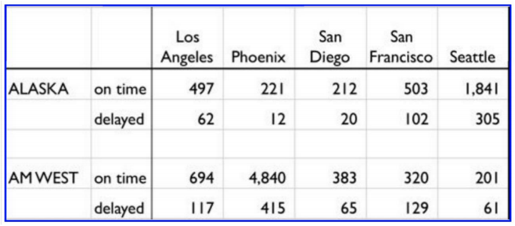

```{r setup, include=FALSE}
knitr::opts_chunk$set(echo = TRUE)
# load packages
library(stringr)
library(XML)
library(RCurl)
library(tau)
library(dplyr)
library(tidyr)
```

# 1. question 

##### The chart above describes arrival delays for two airlines across five destinations. Your task is to:
##### (1) Create a .CSV file (or optionally, a MySQL database!) that includes all of the information above. You’re encouraged to use a “wide” structure similar to how the information appears above, so that you can practice tidying and transformations as described below.
##### (2) Read the information from your .CSV file into R, and use tidyr and dplyr as needed to tidy and transform your data.
##### (3) Perform analysis to compare the arrival delays for the two airlines.
##### (4) Your code should be in an R Markdown file, posted to rpubs.com, and should include narrative descriptions of your data cleanup work, analysis, and conclusions. Please include in your homework submission:
* The URL to the .Rmd file in your GitHub repository. and
* The URL for your rpubs.com web page.

# 2. methodology
##### 1. build original table in csv
##### 2. load and melt

# 2-1. data loading
```{r}
# read csv into R
raw_data <- read.csv("airline_delays.csv", sep = ",")#, check.names = FALSE)
raw_data
```

# 2-2. observations
###### this dataset contains four variables:
* airline, stored in the rows
* status, stored in the rows
* city, spread across the column names,
* count, stored in the cell values

```{r}
# modify column names for easier reference 
headers.raw_data <- raw_data %>% rename(airline = 1, status = 2)
headers.raw_data

# melt test
molten.raw_data <- headers.raw_data %>% pivot_longer(-c(airline, status), names_to = "city", values_to = "count")
molten.raw_data
```

```{r}
# replace period with spaces for values in column "city"
molten.raw_data$city <- str_replace_all(molten.raw_data$city, "\\.", " ")
molten.raw_data
```