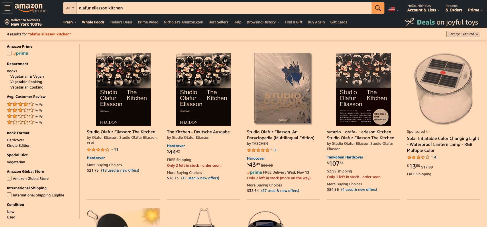
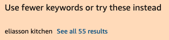
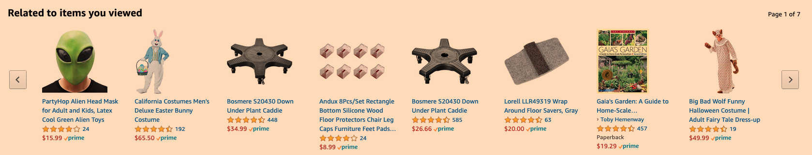
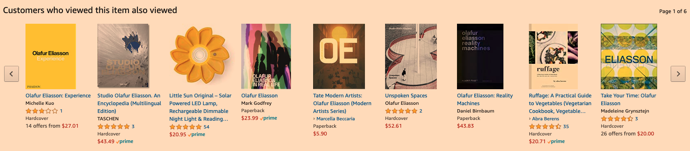
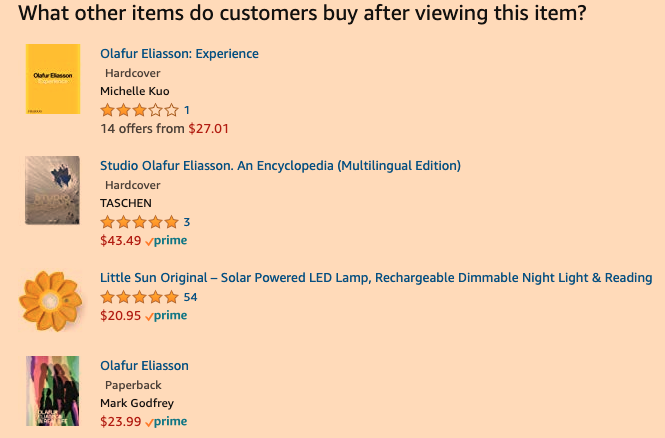
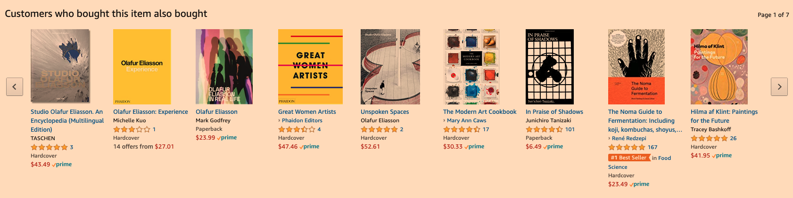
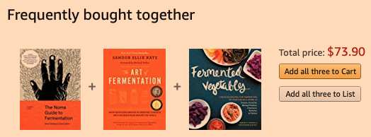

```{r setup, include=FALSE}
knitr::opts_chunk$set(echo = TRUE)
```

# Assignment
Your task is to analyze an existing recommender system that you find interesting. You should:

1. Perform a Scenario Design analysis as described below. Consider whether it makes sense for your selected recommender system to perform scenario design twice, once for the organization (e.g. Amazon.com) and once for the organization's customers.
2. Attempt to reverse engineer what you can about the site, from the site interface and any available information that you can find on the Internet or elsewhere.
3. Include specific recommendations about how to improve the site's recommendation capabilities going forward. 
4. Create your report using an R Markdown file, and create a discussion thread with a link to the GitHub repo where your Markdown file notebook resides.You are not expected to need to write code for this discussion assignment.

# 1. scenario design
##### Who are your target users?
Since Amazon.com is a marketplace with a full range of products at many different price points, countries of origin, points-of-sale, addressing a range of quality and tastes, the target users for Amazon.com may well be any user who shops, and particularly any user who would prefer to shop online. With the assumption that this “universal consumer marketplace” addresses the needs of any conceivable user, for this analysis, we will focus on our own experiences as a representative sample of those who buy most sundry and seasonal items on Amazon.com.

##### What are their key goals?
The users’ goals trend towards efficiency, which can be further categorized into discovery, transactions, and price. Generally speaking, a user’s goal is to obtain the best quality product that can be delivered as quickly as required, at a price point that is as, or more competitive, than the fair market place at any other retail location.   
* Discovery: the user wants to find a selection of products that match their needs. This selection will also include related items that complement the target product.
* Transactions: the user wants to be directed to, purchase, and receive the most relevant product that meets their requirements as quickly as possible. 
* Price: the user wants to make sure they are paying the best price for the selected product. 

##### How can you help them accomplish their goals?
The recommendation engine should demonstrate little to no bias at the start of each unique user session with Amazon.com. Upon the submission of a user query, each subsequent interaction with the initial result set should inform further recommendations. For instance, if a user were searching for a gift, upon sorting by price and then selecting the most expensive item, each recommendation should index highly on price. Likewise, if a user were shopping for the highest quality version of a product at a low price point, upon sorting by price and aggregate user-submitted rating and then selecting the cheapest and highest-rated product, each recommendation should index high on quality and low on price. 

The recommendation engine should also look for common attributes across product searches that may appear unrelated, which may indicate a search contingent on an untagged product feature. As a result, though the recommendations may be incorrect the first session, subsequent sessions should return more accurate recommendations over time. 

User events like returns, complaints, and negative reviews should affect the recommendation engine as well, both within the scope of the immediate user interaction, as well as across future sessions as well.  

# 2. reverse engineering
We will attempt a high-level reverse engineering of Amazon.com using online publications and inferences from the website UX.

We search for “olafur eliasson kitchen”, which the user knows to be a book featuring recipes from Studio Olafor Eliasson, a multimedia art practice based in Berlin. This is a “new” search (i.e., the user has not searched for this book before on Amazon.com) to inform inferences on how the recommendation engine works. For the purpose of this exercise, the user’s goal will be to find similar recipe books.



The initial search returns different versions of the book, as well as sponsored results that are likely related to other products associated with the studio. The filters on the left column enable categorical filtering, which in turn drive recommendations. 

The available recommendations at this point are:
* different keyword combinations, like: 
* user history-based recommendations, like: 

Upon clicking through to the product page, the recommendation engine is able to use the conversion event to inform further recommendations:
* related products based on other users, like: 
* related products associated with similar conversions, like: 
* related conversion associated with similar users who have completed purchase, like: 

Upon clicking through to a related product, “The Noma Guide to Fermentation”, the recommendation engine provides a recommendation for a product bundle, extending the recommendation to a set of highly correlated items: 

For the purpose of this exercise, we will limit our reverse engineering to these observations about the recommendation engine that powers Amazon.com.

As per this paper, it is known that Amazon.com utilize a proprietary algorithm called “item-to-item collaborative filtering”, which, unlike traditional collaborative filtering, is able to scale with their ever-growing catalog and produce high-quality recommendations in realtime.

According to the paper, this algorithm matches the user’s previously purchased and rated items to similar items to then combine those similar items into a recommendation list. Similarity matches for a given item — here, a book — are informed by a table composed of items that customers tend to convert on through purchase together. The final recommendation, a set of books, is likely the result of the computation of correlated items, indexed by popularity, that are related to the user’s past searches, views, and purchases, compared against bundles of purchases that users with similar purchases have purchased together.

These recommendations are very likely further informed by many more attributes, including:
* items that have been added to carts but abandoned;
* user-created wishlists and associated conversions;
* referral sites that brought the user to the site;
* dwell times, or durations of idle state between actions;
* demographic information based on shipping addresses; and
* user segmentation based on user purchase/search history.

# 3. recommendations
The recommendation engine could be further improved by inserting an item it is not confident about into the recommendation list. By additionally providing input methods that enable users to remove an item from the recommendation list, this method of testing could conceivably:
+ drive improvement of the algorithm’s predictive capability;
+ surprise or stretch a user’s idea of what they’re looking for; and
+ build analysis towards a new recommendation list like “Things you weren’t necessarily looking for, but might interest you”.

# references
* [NY Times: building the next New York Times recommendation Engine](https://open.blogs.nytimes.com/2015/08/11/building-the-next-new-york-times-recommendation-engine/) 
* [Amazon.com](https://amazon.com)
* [StackOverflow: how does the amazon recommendation engine work?](https://stackoverflow.com/questions/2323768/how-does-the-amazon-recommendation-feature-work)
* [Wikipedia: recommender system](https://en.wikipedia.org/wiki/Recommender_system)
* [Coursera: recommender metrics](https://www.coursera.org/learn/recommender-metrics?specialization=recommender-systems)
* [Towards Data Science: recommender systems in practice](https://towardsdatascience.com/recommender-systems-in-practice-cef9033bb23a)
* [Towards Data Science: reinforcement learning for news recommendation](https://towardsdatascience.com/reinforcement-learning-ddpg-and-td3-for-news-recommendation-d3cddec26011)

